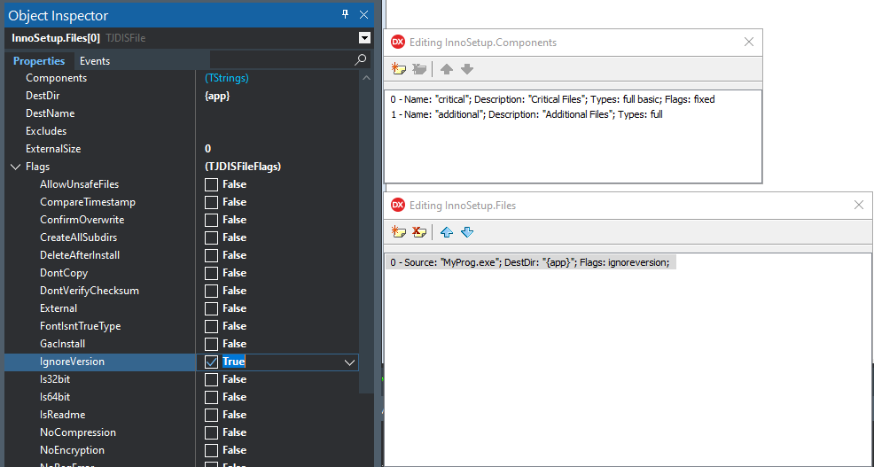
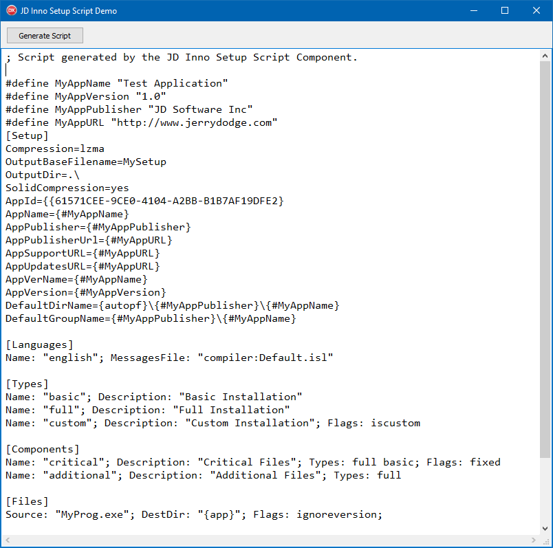

# JDInnoSetupConfig
 Inno Setup Configuration Components for Delphi

## IMPORTANT NOTE
This project is in active development, and is not ready for use at this time. If you do decide to try and use this, use it at your own risk, and carefully review the code. It is subject to change and break in the near future, until I polish it up enough to be fully useful.

## Base Component
The base compnent to use is `TJDInnoSetupScript`. This encapsulates an entire Inno Setup script file. It can be installed into the IDE to drop onto your form or data module, then you can configure it to accomplish almost everything which you can do in a script. In the end, it can dynamically generate an Inno Setup script (.ISS). Future ideas include being able to compile the script directly from within your Delphi project.

## Usage

You can take a look at the demo project to see its usage. But in general, there are two key procedures to generate the script based on your setup:

 - `GetScript(AStrings: TStrings);` - Use this to populate a `TStrings` object with the script. This will forcibly clear any existing data and replace it with ISS script.
 - `SaveScript(const AFilename: String);` - Use this to save the script to a file. It directly uses `GetScript` and then saves it to the specified file.

## Application: JDISConfig

This is a new project which makes use of this component. The app allows you to configure an Inno Setup script using the component via a user interface. 

NOTE: This application requires the following third-party libraries:
 - [JDLib](https://github.com/djjd47130/JDLib) - Font glyphs
 - [SynEdit](https://github.com/SynEdit/SynEdit) - Syntax Highlighter
 - [Vcl-Styles-Utils](https://github.com/RRUZ/vcl-styles-utils) - VCL Styles Utils
 - [DDetours](https://github.com/MahdiSafsafi/DDetours) - DDetours for VCL Styles Utils
 - [FontAwesome](https://fontawesome.com/) - Font Awesome Font Glyphs

